# Android ADB Forensics Analysis - itel P55 (Android 13)

## Overview

In this practical mobile forensics exercise, I performed a forensic examination of an Android device using the Android Debug Bridge (ADB). The objective of this analysis was to demonstrate how ADB can be used to acquire and analyze device information without rooting the device.

Using Kali Linux running inside VMware Workstation, I established a connection between my forensic workstation and the target Android device (itel P55) and collected various artefacts including system information, installed applications, battery statistics, usage timelines, boot information, power management records, and system diagnostic reports.

This project demonstrates foundational Android forensic acquisition techniques that can assist investigators during mobile device examinations, incident response investigations, and digital evidence collection.

---

# Investigation Details

| Item | Details |
|--------|---------|
| Investigation Type | Android Mobile Forensics |
| Acquisition Method | Android Debug Bridge (ADB) |
| Host Operating System | Kali Linux |
| Virtualization Platform | VMware Workstation |
| Mobile Device | itel P55 |
| Model Number | A666L |
| Android Version | Android 13 |
| Storage Capacity | 128 GB |
| RAM | 8 GB (4 GB Physical + 4 GB Extended) |
| CPU | Unisoc T606 (UMS9230) |
| Examiner | Philip Oppong Adanse |

---

# Investigation Objectives

The objectives of this examination were:

- Verify communication between the forensic workstation and the Android device.
- Collect device identification information.
- Enumerate installed applications.
- Identify application installation locations.
- Extract diagnostic and system logs.
- Review battery and power consumption statistics.
- Examine device usage history.
- Determine device uptime and boot information.
- Collect system reports for forensic review.
- Document the physical condition of the device.

---

# Physical Device Documentation

Proper forensic documentation requires recording the physical appearance and specifications of the evidence device.

---

## Front View Documentation

### Evidence

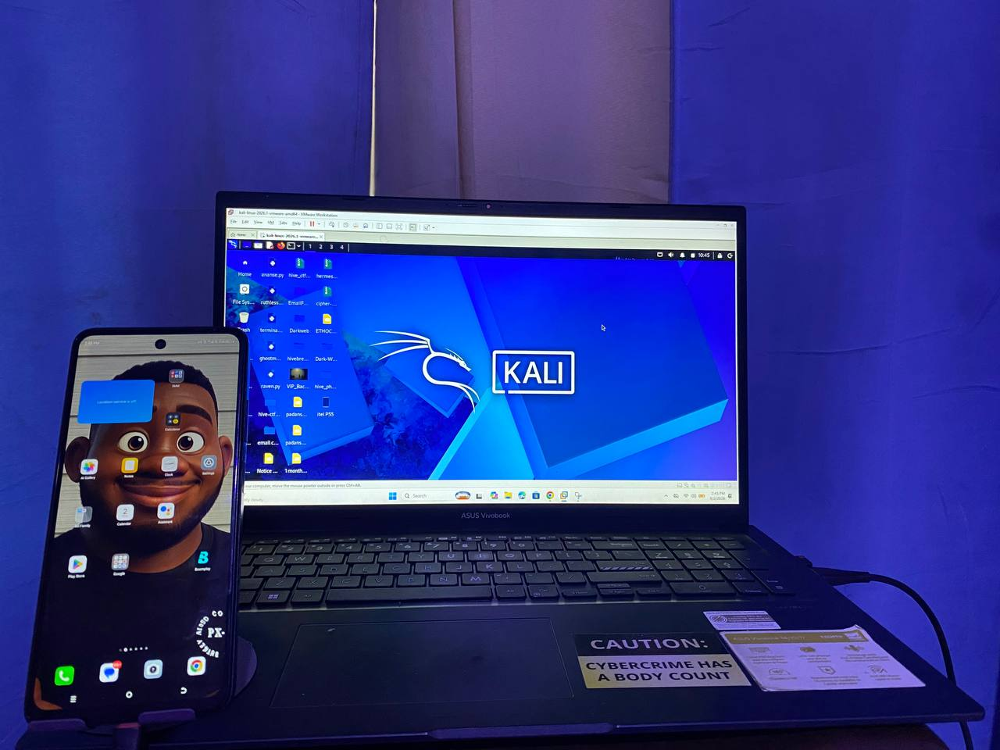

### Observations

The front of the device was photographed to document:

- Screen condition
- Device appearance
- Device state during examination
- Physical characteristics

---

## Rear View Documentation

### Evidence

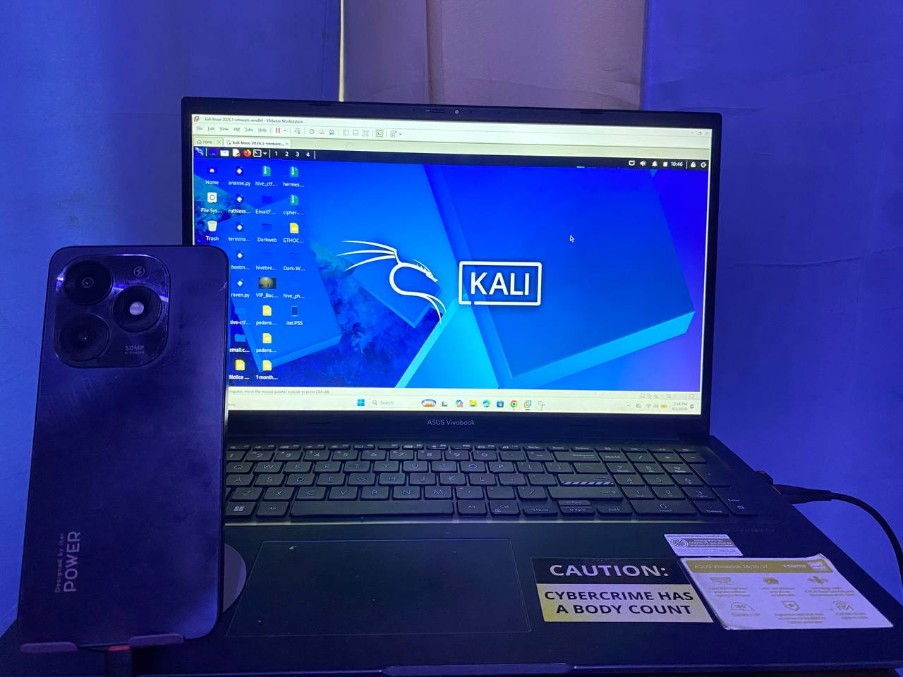

### Observations

The rear photograph documents:

- Camera configuration
- Device branding
- Physical condition
- Device identification features

---

## Device Specifications Documentation

### Evidence

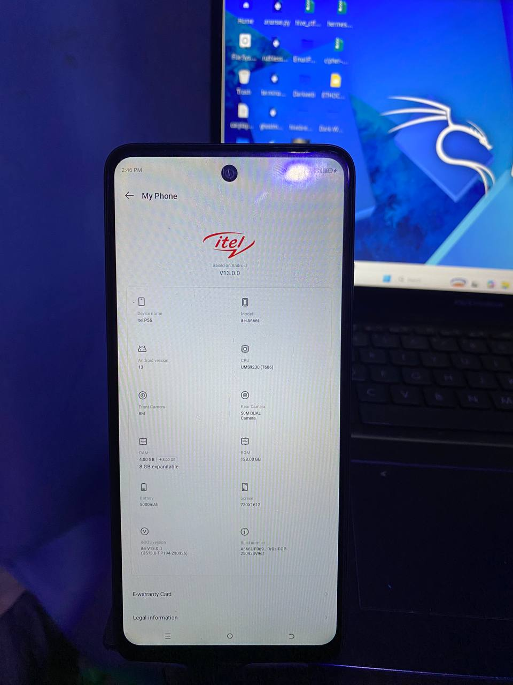

### Recorded Specifications

| Specification | Value |
|--------------|--------|
| Device Name | itel P55 |
| Model | A666L |
| Android Version | 13 |
| CPU | UMS9230 (T606) |
| RAM | 8 GB |
| Storage | 128 GB |
| Battery | 5000 mAh |
| Front Camera | 8 MP |
| Rear Camera | 50 MP Dual Camera |

---

# Forensic Workstation Setup

To perform this examination, I configured a forensic workstation using Kali Linux running inside VMware Workstation.

The Android device was connected to the virtual machine through USB passthrough, allowing ADB to communicate directly with the device.

The forensic environment provided a controlled platform for collecting evidence while maintaining repeatable acquisition procedures.

---

# Evidence Acquisition Process

## Step 1: Device Connection Verification

The first step involved verifying that the Android device was properly connected and recognized by ADB.

### Command

```bash
adb devices
```

### Purpose

This command confirms communication between the forensic workstation and the target device.

### Evidence

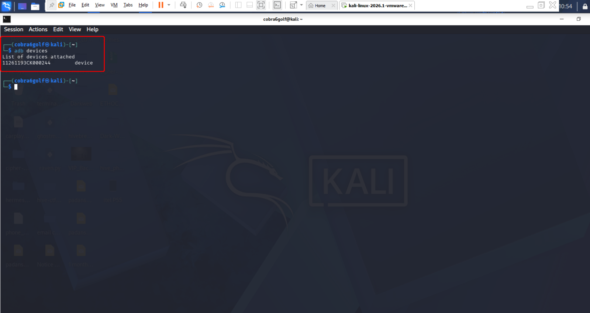

### Findings

The device was successfully detected and listed by ADB, confirming that forensic acquisition activities could proceed.

---

## Step 2: Device Identification and System Information

After confirming connectivity, I collected basic information about the device.

### Commands

```bash
adb shell getprop
```

```bash
adb shell getprop | grep product
```

### Purpose

These commands retrieve Android system properties, including:

- Device manufacturer
- Product information
- Model information
- Build details
- Android version
- System configuration

### Evidence

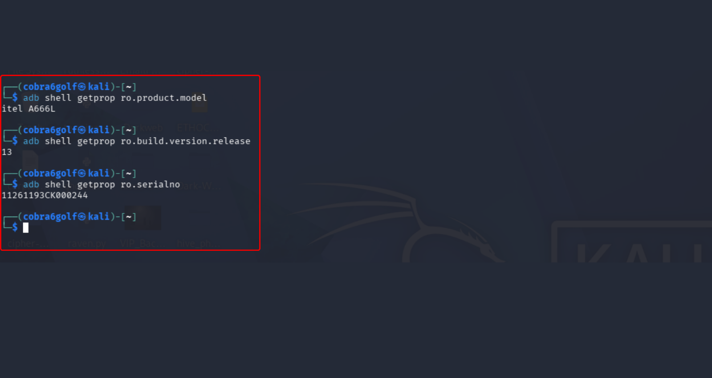

### Findings

The device was identified as:

- Device Name: itel P55
- Model: A666L
- Android Version: 13
- Manufacturer: itel

These artefacts assist in identifying the device during investigations and validating examination scope.

---

# Installed Application Analysis

Understanding installed applications can reveal user behaviour, communication platforms, cloud services, and potential sources of digital evidence.

---

## Application Enumeration

### Command

```bash
adb shell pm list packages
```

### Purpose

This command lists all applications installed on the device.

### Evidence

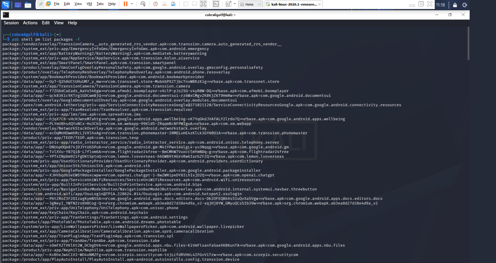

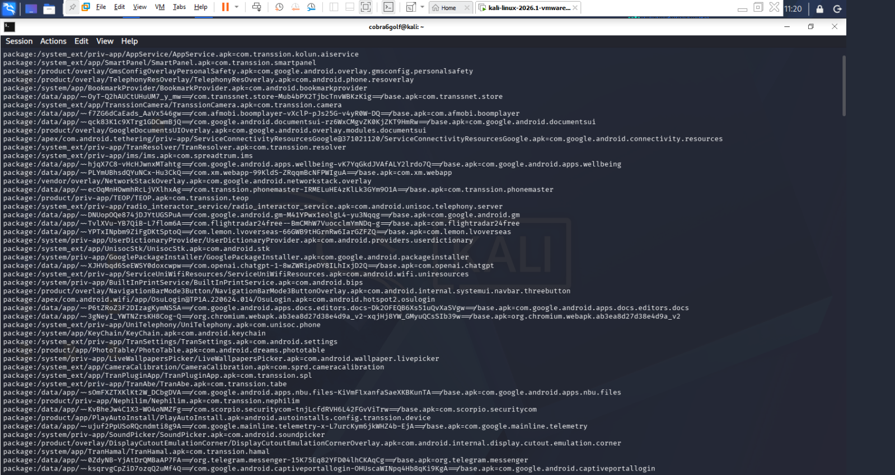

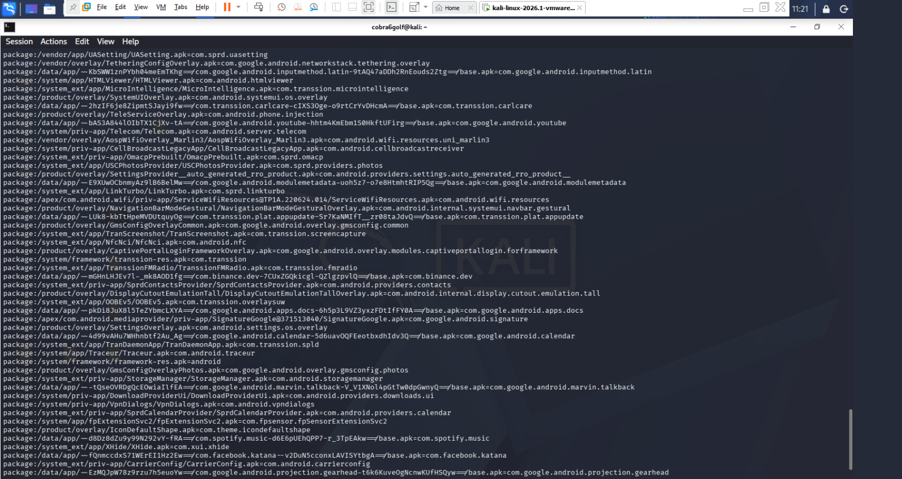

### Findings

Application enumeration revealed multiple installed packages, including:

- System applications
- Vendor applications
- Third-party applications
- User-installed software

The package inventory can be used to identify:

- Social media applications
- Messaging platforms
- Financial applications
- Cloud storage services
- Browser applications

These applications may later become acquisition targets during advanced forensic examinations.

---

# System Log Collection

System logs can provide valuable evidence relating to device activity, errors, user actions, and application events.

### Command

```bash
adb logcat
```

### Purpose

To retrieve Android log data generated by the operating system and installed applications.

### Evidence

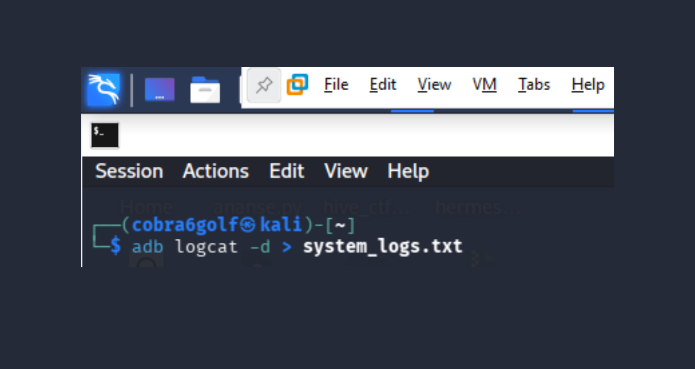

### Findings

Log data contained:

- Application events
- System processes
- Background service activity
- Operating system messages

Log analysis can assist investigators in reconstructing device activity timelines.

---

# Battery and Power Analysis

Battery statistics often provide insight into application activity and device usage patterns.

### Command

```bash
adb shell dumpsys battery
```

### Evidence

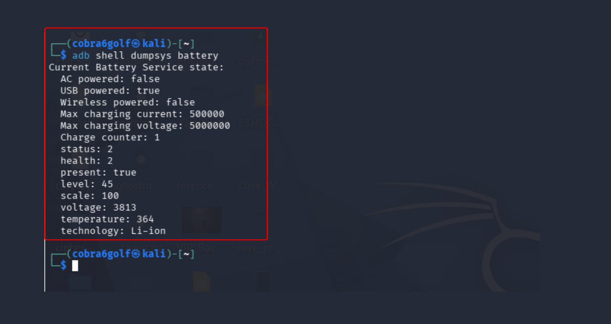

### Findings

The report revealed:

- Battery level information
- Charging status
- Power source information
- Battery health metrics

These artefacts can support timeline reconstruction and identify device usage patterns.

---

# Device Usage Statistics

Android stores application usage information that can reveal user interaction history.

### Command

```bash
adb shell dumpsys usagestats
```

### Evidence

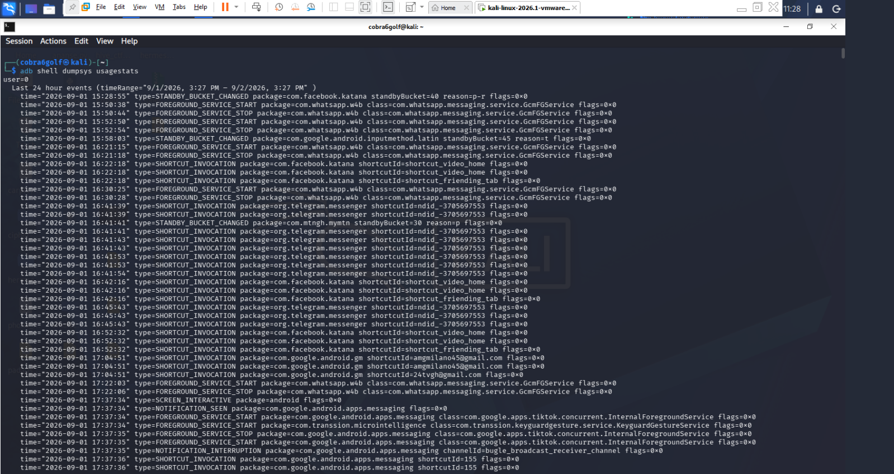

### Findings

Usage statistics contained records showing:

- Application launches
- Foreground activity
- Usage durations
- User interaction patterns

These artefacts can help determine which applications were actively used on the device.

---

# Application Timeline Analysis

Application usage timelines assist investigators in understanding user activity across time.

### Command

```bash
adb shell dumpsys usagestats
```

### Evidence

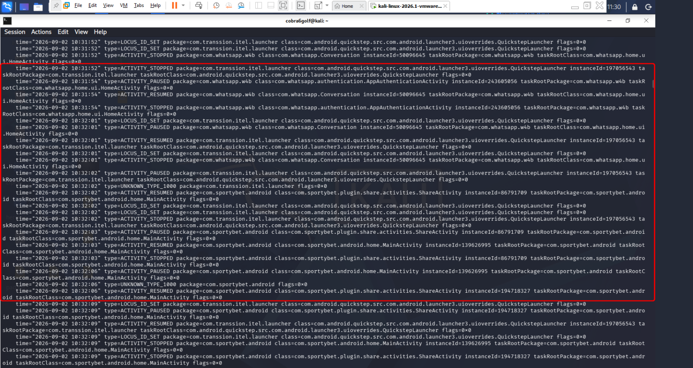

### Findings

The extracted timeline provided historical records showing when applications became active and how frequently they were used. Based on the extracted Android UsageStats artefacts shown in the timeline output, I reconstructed the sequence of user interactions observed on the device during the examination period. This information can be valuable during behavioural and timeline analysis.

## Timeline of User Activity

### 2026-09-02 10:31:52 - Device Launcher Active

The first recorded activity indicates that the device was operating on the default itel launcher.

**Package Observed**

```text
com.transsion.itel.launcher
```

**Event Type**

```text
type=LOCUS_ID_SET
```

#### Interpretation

This event suggests that the user was on the device home screen prior to launching any application.

---

### 2026-09-02 10:31:54 - WhatsApp Business Opened

Shortly after interacting with the launcher, the user opened WhatsApp Business.

**Package Observed**

```text
com.whatsapp.w4b
```

**Activity**

```text
com.whatsapp.Conversation
```

**Event Type**

```text
type=ACTIVITY_RESUMED
```

#### Interpretation

The Conversation activity was resumed, indicating that the user accessed an active WhatsApp Business chat window.

---

### 2026-09-02 10:31:54 - WhatsApp Authentication Activity Triggered

Additional records show an authentication-related activity occurring within WhatsApp Business.

**Activity**

```text
com.whatsapp.authentication.AppAuthenticationActivity
```

**Event Type**

```text
type=ACTIVITY_PAUSED
```

#### Interpretation

This event suggests that WhatsApp initiated an internal authentication or security verification process while the application was in use.

---

### 2026-09-02 10:32:01 - WhatsApp Business Closed or Backgrounded

The WhatsApp conversation activity was subsequently stopped.

**Package**

```text
com.whatsapp.w4b
```

**Event Type**

```text
type=ACTIVITY_STOPPED
```

#### Interpretation

The user exited the active conversation or moved WhatsApp Business into the background.

---

### 2026-09-02 10:32:01 - Return to Home Screen

Immediately after leaving WhatsApp Business, the launcher became active again.

**Package**

```text
com.transsion.itel.launcher
```

**Event Type**

```text
type=ACTIVITY_RESUMED
```

#### Interpretation

This indicates that the user briefly returned to the device home screen.

---

### 2026-09-02 10:32:02 - SportyBet Opened

The next recorded application launched by the user was SportyBet.

**Package**

```text
com.sportybet.android
```

**Activity**

```text
com.sportybet.android.home.MainActivity
```

**Event Type**

```text
type=ACTIVITY_RESUMED
```

#### Interpretation

The SportyBet application was brought into the foreground and became the active application.

---

### 2026-09-02 10:32:03 - SportyBet Share Activity Initiated

Within the SportyBet application, a sharing activity was launched.

**Activity**

```text
com.sportybet.plugin.share.activities.ShareActivity
```

**Event Type**

```text
type=ACTIVITY_RESUMED
```

#### Interpretation

The user accessed a sharing feature available within the application.

---

### 2026-09-02 10:32:06 - Return to SportyBet Main Activity

The sharing activity was exited and the user returned to the primary SportyBet interface.

**Activity**

```text
com.sportybet.android.home.MainActivity
```

**Event Type**

```text
type=ACTIVITY_RESUMED
```

#### Interpretation

This indicates that the sharing function was closed and the application resumed normal operation.

---

### 2026-09-02 10:32:09 - Share Activity Reopened

A second ShareActivity event was recorded.

**Activity**

```text
com.sportybet.plugin.share.activities.ShareActivity
```

**Event Type**

```text
type=ACTIVITY_RESUMED
```

#### Interpretation

The user appears to have reopened the sharing feature within SportyBet.

This is the final recorded foreground activity observed in the extracted UsageStats artefacts.

---

## Reconstructed User Navigation Path

```text
itel Launcher
      │
      ▼
WhatsApp Business
      │
      ▼
WhatsApp Conversation
      │
      ▼
WhatsApp Authentication Activity
      │
      ▼
Return to Launcher
      │
      ▼
SportyBet Main Activity
      │
      ▼
SportyBet Share Activity
      │
      ▼
SportyBet Main Activity
      │
      ▼
SportyBet Share Activity
      │
      ▼
Last Recorded Activity
```

---

## Forensic Findings

Based on the analyzed UsageStats artefacts, I determined that the user initially interacted with the device launcher before opening WhatsApp Business and accessing a conversation window. After approximately seven seconds of activity within WhatsApp Business, the user exited the application and returned to the home screen.

Shortly thereafter, the user launched the SportyBet application. During the SportyBet session, the user accessed the application's sharing functionality multiple times, as evidenced by repeated ShareActivity events. The final recorded foreground activity within the extracted artefacts was associated with SportyBet's ShareActivity.

No additional application transitions were observed after the final SportyBet activity, making it the last recorded user interaction within the available UsageStats evidence.

---

## Timeline Summary Table

| Timestamp | Application | Activity | Observation |
|------------|------------|------------|-------------|
| 10:31:52 | itel Launcher | Launcher Active | User on home screen |
| 10:31:54 | WhatsApp Business | Conversation Activity | Chat window opened |
| 10:31:54 | WhatsApp Business | Authentication Activity | Security/authentication event |
| 10:32:01 | WhatsApp Business | Activity Stopped | WhatsApp exited/backgrounded |
| 10:32:01 | itel Launcher | Activity Resumed | Returned to home screen |
| 10:32:02 | SportyBet | MainActivity | Application launched |
| 10:32:03 | SportyBet | ShareActivity | Sharing feature accessed |
| 10:32:06 | SportyBet | MainActivity | Returned to application |
| 10:32:09 | SportyBet | ShareActivity | Sharing feature reopened |
| Final Activity | SportyBet | ShareActivity | Last recorded foreground activity |

---

# Power Whitelist Examination

Android maintains a whitelist of applications exempt from certain power management restrictions.

### Command

```bash
adb shell dumpsys deviceidle whitelist
```

### Evidence

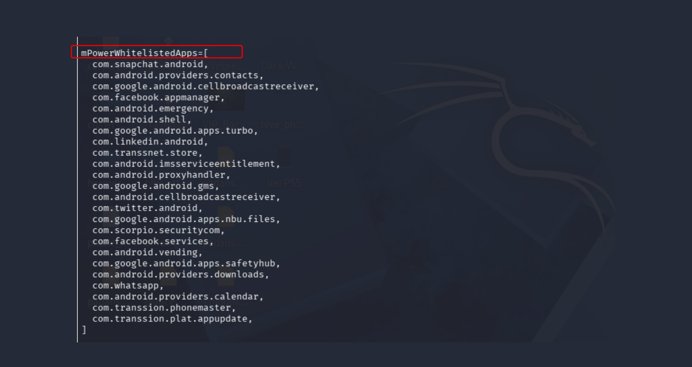

### Findings

The whitelist identified applications permitted to operate with fewer battery restrictions.

Such applications may continue operating in the background and can generate persistent evidence.

---

# Boot Time Analysis

Determining device uptime and boot history is often important in forensic investigations.

### Command

```bash
adb shell uptime
```

### Evidence

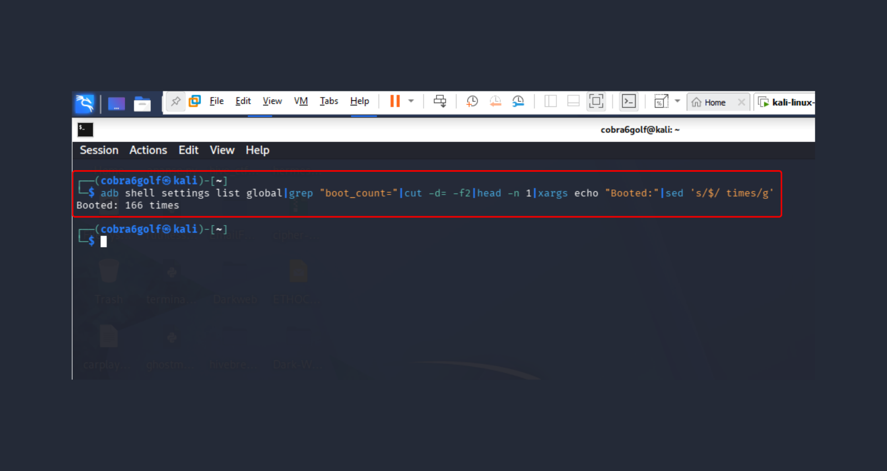

### Findings

Boot information revealed:

- Device uptime
- Time since last reboot
- Operational duration

These artefacts assist in constructing forensic timelines.

---

# Comprehensive System Diagnostics

To gather additional forensic artefacts, I generated detailed system reports using Android's diagnostic framework.

### Command

```bash
adb shell dumpsys
```

### Evidence

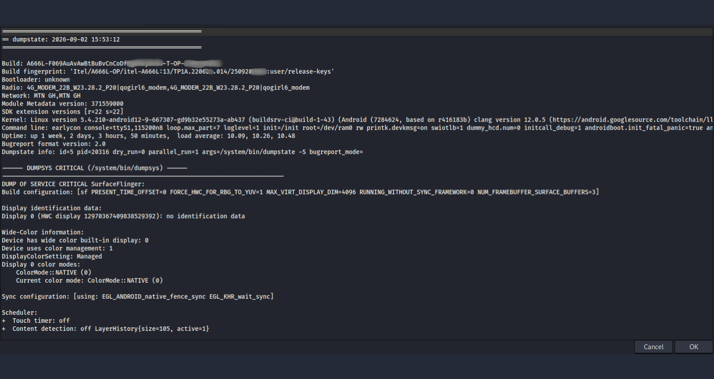

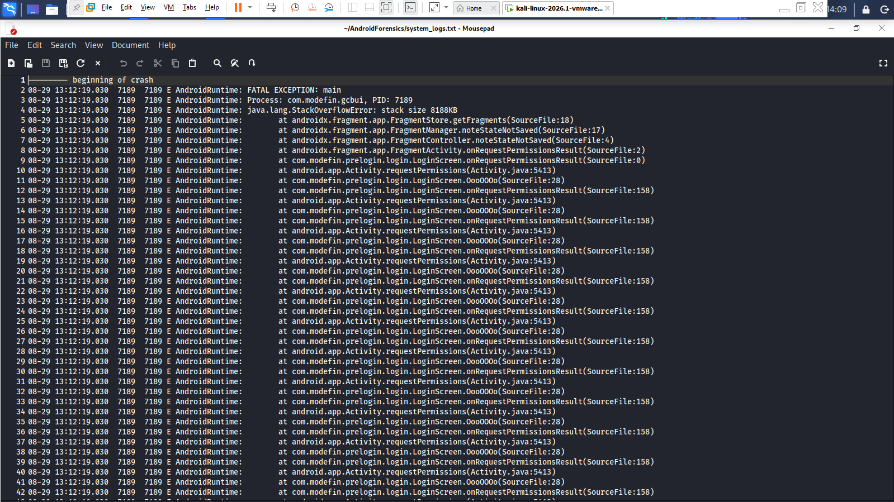

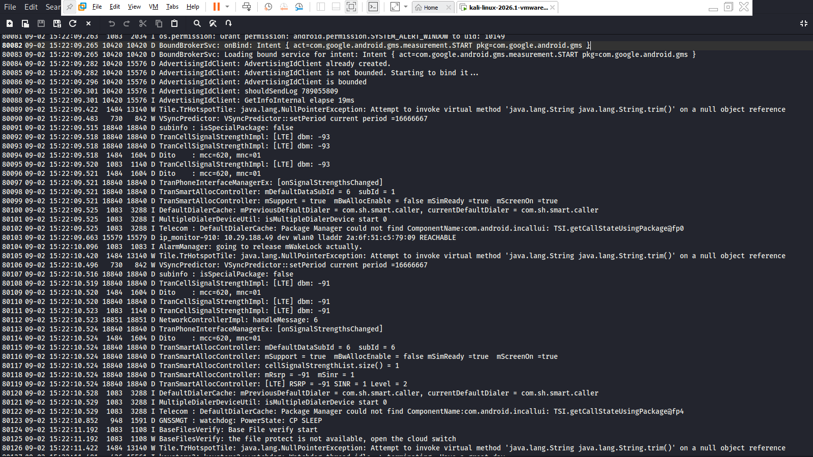

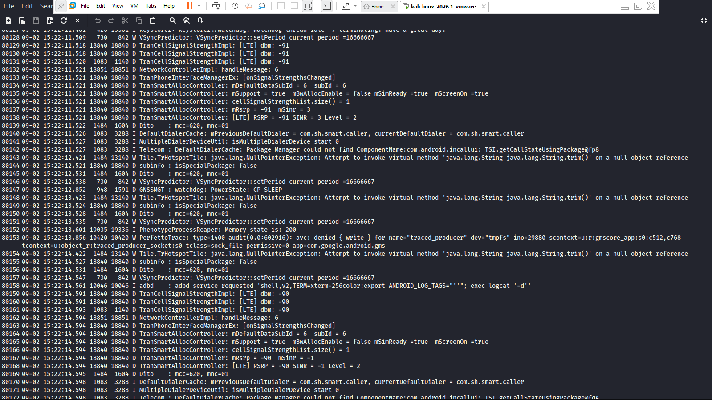

### Findings

The generated reports contained extensive information including:

- Running services
- Active processes
- Memory information
- Hardware configuration
- Network data
- Power statistics
- System state information

These reports provide investigators with a comprehensive snapshot of the device at the time of examination.

---


# Key Forensic Artefacts Identified

During this examination, I successfully acquired the following categories of forensic artefacts:

- Device identification data
- Android system properties
- Installed application inventory
- Application package locations
- System log records
- Battery statistics
- Power management information
- Usage statistics
- Application timelines
- Device uptime information
- Diagnostic reports
- Physical device documentation

---

# Limitations

This examination was performed using standard ADB access without rooting the device.

As a result:

- Protected application databases were not accessed.
- Deleted data recovery was not performed.
- Full file system acquisition was not conducted.
- Physical extraction was not performed.

Despite these limitations, ADB provided substantial forensic artefacts suitable for preliminary examinations and intelligence gathering.

---

# Conclusion

In this investigation, I successfully conducted a forensic examination of an Android device using Android Debug Bridge (ADB) on a Kali Linux forensic workstation.

The examination demonstrated how ADB can be leveraged to collect valuable evidence from Android devices without requiring root access. Through the acquisition process, I documented device specifications, enumerated installed applications, reviewed system logs, analyzed battery statistics, examined usage timelines, identified power management artefacts, and generated comprehensive diagnostic reports.

The artefacts collected during this examination provide valuable insight into device configuration, user activity, system state, and operational history. This exercise highlights the effectiveness of ADB as a practical forensic acquisition tool and reinforces the importance of systematic evidence collection and documentation during Android mobile forensic investigations.

## Disclaimer

This analysis was conducted exclusively on **my personally owned Android device** for educational, research, and digital forensic training purposes.

The device examined throughout this project is an **itel P55 (Android 13)** that belongs to me, and all data collected, analyzed, and documented originated from my own device. No third-party device, personal data, or information belonging to another individual was accessed, acquired, or examined during this exercise.

The objective of this project was to demonstrate the use of **Android Debug Bridge (ADB)** as a forensic acquisition and analysis tool, while developing practical skills in Android artifact collection, system interrogation, application enumeration, event timeline reconstruction, and device state analysis.

All commands executed were performed in a controlled laboratory environment using:

- Kali Linux 2026.1 (VMware Workstation)
- Android Debug Bridge (ADB)
- Personal Android test device (itel P55)
- Authorized USB debugging connection

This repository is intended solely for:

- Digital Forensics Training
- DFIR Research
- Academic Learning
- Skill Development
- Portfolio Demonstration

No unauthorized access techniques, privilege escalation methods, data manipulation activities, or intrusive forensic procedures were performed during this examination.

All findings documented in this repository should be interpreted as results obtained from a self-owned test device and must not be considered evidence from a real-world investigation.

> **Note:** The screenshots, artifacts, timelines, and observations contained within this repository were generated from my own device and are published strictly for educational and professional portfolio purposes.

